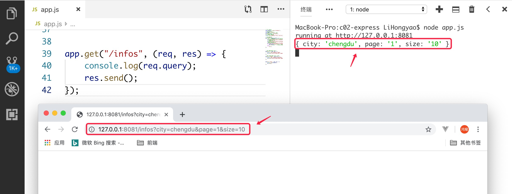
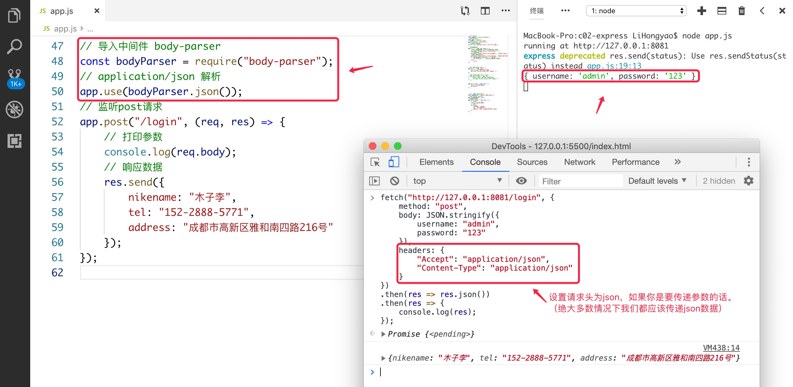
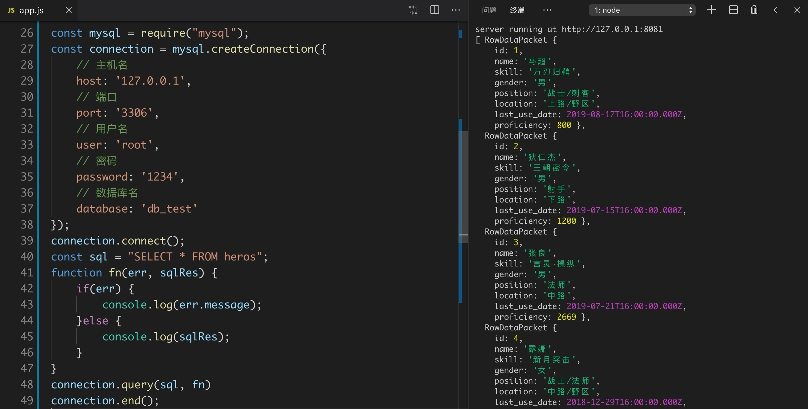
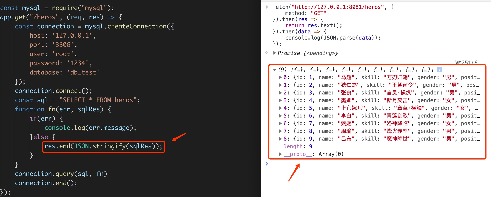
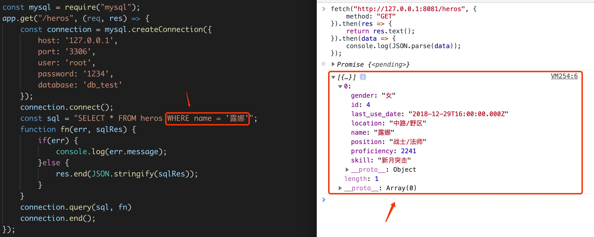
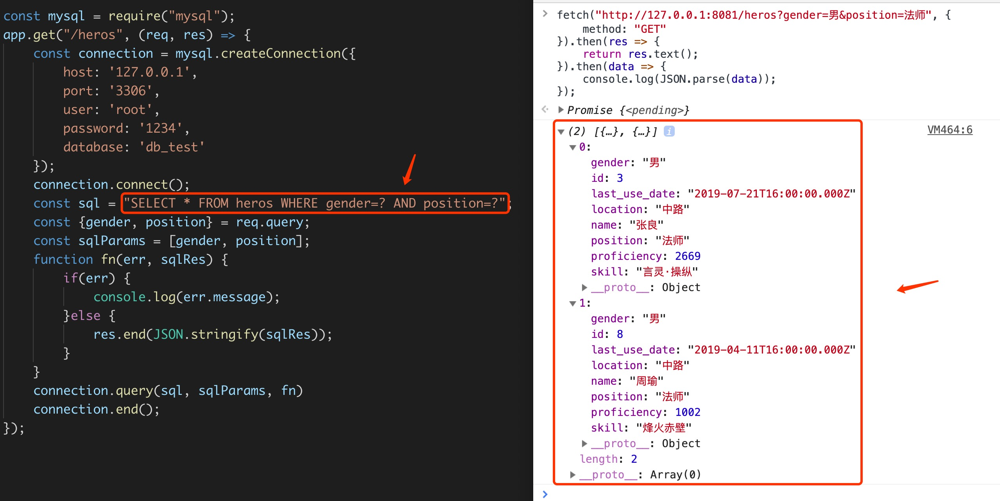
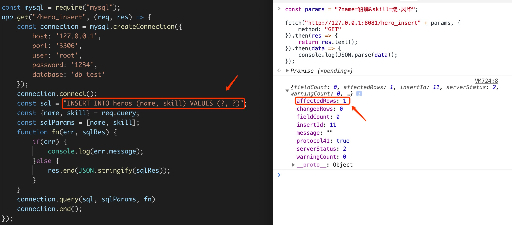
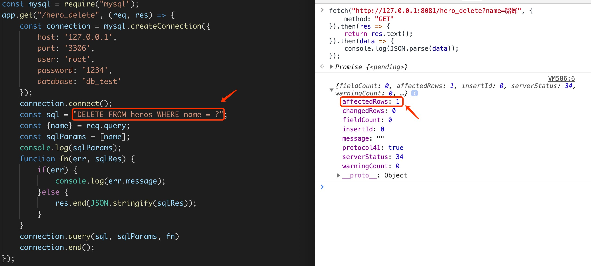

# 一、什么是Express？

<http://www.expressjs.com.cn/>

基于 [Node.js](https://nodejs.org/en/) 平台，快速、开放、极简的 Web 开发框架。提供了一系列强大特性帮助你创建各种Web 应用，和丰富的 HTTP 工具。使用 Express 可以快速地搭建一个完整功能的网站。

Express 框架核心特性：

- 可以设置中间件来响应HTTP 请求。

- 定义了路由表用于执行不同的HTTP 请求动作。

- 可以通过向模板传递参数来动态渲染HTML 页面。

# 二、安装

通过npm安装：

```shell
  $ npm i -S express
```

安装完成后，我们可通过如下指令查看express版本号：

```shell
$ npm list express
└── express@4.17.1 
```

以下模块是需要与express 框架一起安装的：

- `body-parser` ： nodeJS中间件，用于处理 JSON, Raw, Text 和 URL 编码的数据。

- `cookie-parser` ：解析Cookie的工具 。通过req.cookies可以取到传过来的cookie，并把它们转成对象。

- `multer`：nodeJS中间件，用于处理 enctype="multipart/form-data"（设置表单的MIME编码）的表单数据。

```shell
$ npm i -S body-parser cookie-parser multer
```

# 三、构建服务器

在项目根目录创建app.js文件

```js
// 1. 导入express
const express = require("express");
// 2. 创建express实例
const app = express();
// 3. 监听 http://127.0.0.1:8081"
app.listen(8081, "127.0.0.1");
// 4. 监听GET请求，用户访问路径‘/’
app.get("/", function (req, res) {
    // req -> request -> 请求对象
    // res -> response -> 响应对象
  	// 响应，向前端发送数据
    res.send("Hello, express!");
});
// 5. 打印输出提示信息
console.log("server running at http://127.0.0.1:8081");
```

终端执行脚本，运行app.js

```shell
$ node app.js
```

在浏览器输入：“http://127.0.0.1:8081”，可看到页面输出“Hello, express!”

# 四、处理跨域

## 1. 允许所有域名跨域

```js
app.all("*", (req, res, next) => {
    //设置允许跨域的域名，*代表允许任意域名跨域
    res.header("Access-Control-Allow-Origin","*");
    //允许的header类型
    res.header("Access-Control-Allow-Headers","content-type");
    //跨域允许的请求方式 
    res.header("Access-Control-Allow-Methods","DELETE,PUT,POST,GET,OPTIONS");
    if (req.method.toLowerCase() == 'options')
        res.send(200);  // 让options尝试请求快速结束
    else
        next();
});
```

## 2. 允许指定域名跨域

假定允许 “http://127.0.0.1:5500” 访问：

```js
app.all("*", (req, res, next) => {
    //设置允许跨域的域名，*代表允许任意域名跨域
    res.header("Access-Control-Allow-Origin","http://127.0.0.1:5500");
    //允许的header类型
    res.header("Access-Control-Allow-Headers","content-type");
    //跨域允许的请求方式 
    res.header("Access-Control-Allow-Methods","DELETE,PUT,POST,GET,OPTIONS");
    if (req.method.toLowerCase() == 'options')
        res.send(200);  //让options尝试请求快速结束
    else
        next();
});
```

## 3. 允许多个域名跨域

```js
app.all("*", (req,res,next) => {
    //定义允许跨域的域名集合
    const origin_list = [
        "http://127.0.0.1:5500",
        "http://127.0.0.1:5501",
        "http://127.0.0.1:5502"
    ];
    if(origin_list.includes(req.headers.origin.toLowerCase())) {
        //设置允许跨域的域名，*代表允许任意域名跨域
        res.header("Access-Control-Allow-Origin", req.headers.origin);
    }
    //允许的header类型
    res.header("Access-Control-Allow-Headers","content-type");
    //跨域允许的请求方式 
    res.header("Access-Control-Allow-Methods","DELETE,PUT,POST,GET,OPTIONS");
    if (req.method.toLowerCase() == 'options')
        res.send(200);  //让options尝试请求快速结束
    else
        next();
});
```

# 五、路由

## 1. 基本操作

路由是指如何定义应用的端点（URIs）以及如何响应客户端的请求。路由是一个由URI、HTTP请求（GET/POST等）和若干个句柄组成，它的语法结构如下：

```js
app.METHOD(PATH, HANDLER)
```

语法解读：

- `app`：express对象的一个实例
- `METHOD`：http请求方法（get/post），小写
- `PATH`：服务器上的路径
- `HANDLER`：当路由匹配时要执行的处理函数

```js
// GET请求
app.get("/", function(req, res) {
    console.log("有人通过GET访问：/");
}); 
// POST请求
app.post("/login", function(req, res) {
    console.log("有人通过POST访问：/login");
});
```

路由方法的第一个参数可以为一个字符串，也可以为一个数组，为字符串时还可以使用正则匹配。

```js
// 正则匹配，*表示0个或多个字符
app.get("/ab*cd", (req, res) => {
    res.send("正则匹配");
});
// 路由处理也可以是一个数组
app.post(["/usr", "/user"], (req, res) => {
    res.send();
});                  
```

## 2. 模块化配置

将路由定义在app.js文件中，不利于阅读维护，特别是在项目比较大的情况下，所以我们需要将路由模块化。比如项目有用户、和商品功能，那我们就定义2个路由，文件结构如下：

```
|- proj
	|- routes
  		|- user.js
  		|- order.js
  |- app.js	
```

路由分析：

```
用户路由 
-> 信息 /user          -> GET  http://127.0.0.1:8080/user
-> 登陆 /user/login		 -> POST http://127.0.0.1:8080/user/login
-> 注册 /user/register -> POST http://127.0.0.1:8080/user/register

订单路由 
-> 查询 /order					-> GET http://127.0.0.1:8080/order
-> 增加 /add						-> GET http://127.0.0.1:8080/order/add
-> 删除 /delete					-> GET http://127.0.0.1:8080/order/delete
-> 修改 /update					-> GET http://127.0.0.1:8080/order/update
```

*user.js*

```js
/* 用户路由 */
// 1. 导入express模块
const express = require("express");
// 2. 获取路由对象
const router  = express.Router();
// 3. 处理路由对象
router.get("/", (req, res) => {
    res.send("客户端想要获取用户信息");
});
router.post("/login", (req, res) => {
    res.send("客户端想要执行登陆操作");
});
router.post("/register", (req, res) => {
    res.send("客户端想要执行注册操作");
});

// 4. 导出路由
module.exports = router;
```

*order.js*

```js
/* 订单路由 */
// 1. 导入express模块
const express = require("express");
// 2. 获取路由对象
const router  = express.Router();
// 3. 处理路由对象
router.get("/", (req, res) => {
    res.send("客户端想要获取订单信息");
});
router.get("/add", (req, res) => {
    res.send("客户端想要添加一条订单");
});
router.get("/delete", (req, res) => {
    res.send("客户端想要删除一条订单");
});
router.get("/update", (req, res) => {
    res.send("客户端想要更新一条订单");
});

// 4. 导出路由
module.exports = router;
```

*app.js*

```js
// 1. 导入express
const express = require("express");
// 2. 创建express实例
const app = express();
// 3. 处理跨域
app.all("*", (req, res, next) => {
    //设置允许跨域的域名，*代表允许任意域名跨域
    res.header("Access-Control-Allow-Origin","*");
    //允许的header类型
    res.header("Access-Control-Allow-Headers","content-type");
    //跨域允许的请求方式 
    res.header("Access-Control-Allow-Methods","DELETE,PUT,POST,GET,OPTIONS");
    if (req.method.toLowerCase() == 'options')
        res.send(200);  // 让options尝试请求快速结束
    else
        next();
});
// 4. 监听 http://127.0.0.1:8081"
app.listen(8081, "127.0.0.1");

// 5. 中间件
const bodyParser = require("body-parser");
app.use(bodyParser.json());
app.use(bodyParser.urlencoded({ extended: false }));

// 6. 处理路由
const userRouter  = require("./routes/user");
const orderRouter = require("./routes/order");
app.use("/user", userRouter);
app.use("/order", orderRouter);

// 7. 打印输出提示信息
console.log("server running at http://127.0.0.1:8081");
```

# 六、参数

### 2.1. GET

在Express中直接使用请求对象 `req` 的 `query` 属性即可获取，而且最终获取的还是已经被转换为对象了的参数，在原生nodeJS实现中，我们还需要使用 `queryString` 模块来进行显式的转换。



### 2.2. POST

这里需要使用我们刚才安装的 `body-parser` 模块，获取POST参数，需注意以下几点：

- 前端代码需要传递请求头，请求参数需以JSON字符串形式传递。

- 后端代码需要添加中间件 `body-parser`（**牢记**）
- 经过中间件的处理，参数会自动的添加到req请求对象上，作为其一个属性body



前端代码：

```js
fetch("http://127.0.0.1:8081/login", {
    method: "post",
    body: JSON.stringify({
        username: "admin",
        password: "123"
    }),
    headers: {
        "Accept": "application/json",
        "Content-Type": "application/json"
    }
})
.then(res => res.json())
.then(res => {
    console.log(res);
});
```

后端代码：

```js
// 导入中间件 body-parser
const bodyParser = require("body-parser");
// application/x-www-form-urlencoded 解析
app.use(bodyParser.urlencoded({extended:false}));
// application/json 解析
app.use(bodyParser.json());
// 监听post请求
app.post("/login", (req, res) => {
    // 打印参数
    console.log(req.body);
    // 响应数据
    res.send({
        nikename: "木子李",
        tel: "152-2888-5771",
        address: "成都市高新区雅和南四路216号"
    });
});
```

关于body-parser中间件详细内容可参考如下文章：

<https://www.jianshu.com/p/ea0122ad1ac0>

# 七、请求与响应

- [request](http://www.expressjs.com.cn/4x/api.html#req)：HTTP请求对象，包含了请求查询字符串，参数，内容，HTTP 头部等属性
- [response](http://www.expressjs.com.cn/4x/api.html#res)：HTTP 响应对象，即在接收到请求时向客户端发送的 HTTP 响应数据

在Express中，请求对象与相应对象作为路由处理函数的参数返回，如下所示：

```js
app.get("/", (req, res) => {
  // req.body  -> 读取post参数
  // req.query -> 读取get参数
  // res.send  -> 响应客户端
});
```

关于req、res常用属性和方法，点击上述链接进入API文档查看。

# 八、静态资源访问

通过Express 提供的内置中间件 **<ins>express.static</ins>** ，我们可以实现访问静态资源（如图片、CSS、JavaScript等）的需求。例如，如果将图片、CSS、JavaScript 文件放在 public 目录下，你可以这么写：

```js
app.use(express.static("public"));
```

那我们即可在浏览器中通过”http://127.0.0.1:8081/images/logo.png“访问静态资源了。

服务器端静态资源的文件结构如下：

```
|- proj
	 └── routes
	 └── app.js
	 └── public
  	 		└── images
  	 		└── javascripts 		
  	 		└── stylesheets
```

总结：

\1. 在最开始处使用express内置的static中间件，来实现静态文件的访问。

\2. 前端访问时，地址栏只需输入服务器地址 + express.static 参数类的路径和文件名称即可。

# 九、链接数据库

## 1. 流程

a）、安装mysql模块

```shell
$ npm i -S mysql
```

b）、导入mysql模块

```js
const mysql = require("mysql");
```

c）、链接数据库

```js
const connection = mysql.createConnection({
    // 主机名
    host: '127.0.0.1',
    // 端口
    port: '3306',
    // 用户名
    user: 'root',
    // 密码
    password: '1234',
    // 数据库名
    database: 'db_test'
});
connection.connect(); // 启动连接
// 数据库操作...
connection.end(); // 关闭连接
```

更多参数参考：<https://www.npmjs.com/package/mysql#connection-options>

## 2. 操作

在连接数据库的情况下我们开始操作数据库链接对象：connection。

mysql 数据库heros表中的字段信息：


mysql 数据库heros表中的数据信息：


### 2.1. 查询数据库信息

**-> 语法形式：**

```js
connection.query(sql,function (err, sqlRes) {});
```

**-> 参数解读：**

- `sql`：操作数据库的指令（sql语句）
- `function(){}`：返回查询结果的回调函数

**-> 代码示例：**

```js
connection.connect();
const sql = "SELECT * FROM heros";
function fn(err, sqlRes) {
    if(err) {
        console.log(err.message);
    }else {
        console.log(sqlRes);
    }
}
connection.query(sql, fn)
connection.end();  // 操作完数据库记得关闭链接
```

**-> 注意事项：**

1）如果你想通过定时器来循环操作数据库，那么数据库的开启链接语句一定要放在这些语句之外。

2）关闭链接语句要写的话也应该写在定时执行的函数里面，不然定时器执行一次，链接就会关掉，就无法在操作数据库了。

3）关闭链接后，获取数据库链接对象只能重新执行*mysql.createConnection()*方法。

4）不能多次重复调用 *.connect()* 方法，否则会报错。

5）不能多次重复调用 *.end()* 方法，否则会报错。

**-> 查询结果：**



**-> 遍历结果：**

实际上查询出的结果是一个对象数组，我们可以通过下标与键取出其中详细数据，也能通过循环将其所有值遍历出来

-> 1. 单独取值：

```js
reqRes.[0];
reqRes.[0].name;
```

-> 2. 遍历取值

```js
for(let i = 0, len = reqRes.length; i < len; i++) {
    console.log(reqRes[i]);
}
```

-> 3. 将查询结果返回给前端



可以看到，都不需要做什么处理，直接把查询结果用 *JSON.parse(sqlRes)* 转换为字符串就可以发到前端了，前端在转换为对象数组就能直接用了

-> 4. 条件查询



-> 5. 预编译写法

其实这里可以写成预编译的方式，可以避免sql注入的问题，所谓预编译就是说对于原本在sql里面写值换成`？`占位，然后传入一个数组进去补全这个占位符，也就是*connect.query* 方法会多一个参数，为一个数组，放入第二个位置。



### 2.2. 修改数据库信息

**-> 语法形式：**

```js
connection.query(sql, sqlParams, function (err, sqlRes) {});
```

**-> 参数解读：**

- `sql`：sql指令，如：*UPDATE heros SET location=? WHERE name=?*
- `sqlParams`：sql参数，如：*["上路", "周瑜"]*
- `function(){}`：执行结果回调函数

**-> 代码示例：**


> 提示：我们可通过影响行数 *affectedRows* 属性判断是否修改成功。

### 2.3. 添加数据信息

**-> 语法形式：**

```js
connection.query(sql, sqlParams, function (err, sqlRes) {});
```

**-> 参数解读：**

- `sql`：sql指令，如：*INSERT INTO heros (name, skill) VALUES (?, ?)*
- `sqlParams`：sql参数，如：*["貂蝉", "绽·风华"]*
- `function(){}`：执行结果回调函数

**-> 代码示例：**



### 2.4. 删除数据信息

**-> 语法形式：**

```js
connection.query(sql, sqlParams, function (err, sqlRes) {});
```

**-> 参数解读：**

- `sql`：sql指令，如：*DELETE FROM heros WHERE name=?*
- `sqlParams`：sql参数，如：*["貂蝉"]*
- `function(){}`：执行结果回调函数

**-> 代码示例：**



## 3. 链接数据库封装

### 3.1. 概述

在上面我们每次操作数据库都要先连接下数据库，然后才能操作，那么我们是否能够把数据的链接封装起来呢，这样每次直接获取链接对象，来操作数据库即可，会方便不少。

### 3.2. 示例

```js
const mysql = require("mysql");
const defaultOptions = {
    host: '127.0.0.1',
    port: '3306',
    user: 'root',
    password: '1234',
    database: 'db_test'
}
function getConnection(options = defaultOptions) {
    return mysql.createConnection(options);
}
module.exports = getConnection;
```

使用

```js
const getConnection = require("./mysqlConnection");
const db = getConnection();
app.get("/heros", (req, res) => {
    db.connect();
    const sql = "SELECT * FROM heros";
    function fn(err, sqlRes) {
        if(err) {
            console.log(err.message);
        }else {
            res.end(JSON.stringify(sqlRes));
        }
    }
    db.query(sql, fn)
    db.end();
});
```

## 4. 异常

链接数据库时报错：*client does not support authentication protocol requested by server consider*，解决办法参考[这里](https://blog.csdn.net/m_amazing/article/details/84313789>)。


​     


