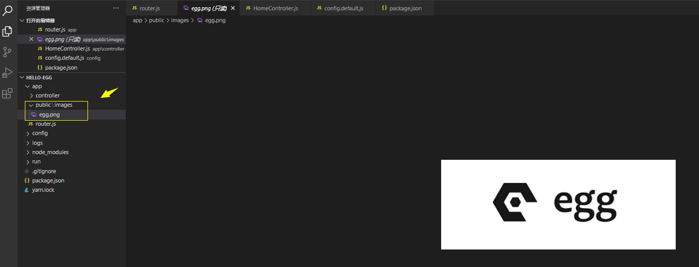

https://www.postman.com/downloads/

# 一、概述

中文官网：https://eggjs.org/zh-cn/

## 1. Egg.js 是什么（诞生目的）？

**Egg.js 为企业级框架和应用而生**，帮助开发团队和开发人员降低开发和维护成本。

> 注：Egg.js 缩写为 Egg

## 2. 设计原则（核心功能+插件机制）

egg考虑到 企业级应用在追求规范和共建的同时，还需要思考如何平衡不同团队之间的差异，求同存异。所有egg没有选择社区常见框架的大集市模式（集成如数据库、模板引擎、前端框架等功能），而是专注于提供 Web 开发的**核心功能**和一套灵活可扩展的**插件机制**。

通过 Egg插件机制，团队的架构师和技术负责人可以非常容易地基于自身的技术架构在 Egg 基础上扩展出适合自身业务场景的框架。

最后：Egg 奉行『**约定优于配置**』，按照[一套统一的约定](https://eggjs.org/zh-cn/advanced/loader.html)进行应用开发。

## 3. 与社区框架的差异（和express/sails差异）

[Express](http://expressjs.com/) 是 Node.js 社区广泛使用的框架，简单且扩展性强，非常适合做个人项目。但框架本身缺少约定，标准的 MVC 模型会有各种千奇百怪的写法。Egg 按照约定进行开发，奉行『约定优于配置』，团队协作成本低。【[Express](http://expressjs.com/) 框架缺少约定】。

[Sails](http://sailsjs.com/) 是和 Egg 一样奉行『约定优于配置』的框架，扩展性也非常好。但是相比 Egg，[Sails](http://sailsjs.com/) 支持 Blueprint REST API、[WaterLine](https://github.com/balderdashy/waterline) 这样可扩展的 ORM、前端集成、WebSocket 等，但这些功能都是由 [Sails](http://sailsjs.com/) 提供的。而 Egg 不直接提供功能，只是集成各种功能插件，比如实现 egg-blueprint，egg-waterline 等这样的插件，再使用 sails-egg 框架整合这些插件就可以替代 [Sails](http://sailsjs.com/) 了。【sails框架本身集成了很多功能】.

## 4. 特性

- 提供基于 Egg [定制上层框架](https://eggjs.org/zh-cn/advanced/framework.html)的能力
- 高度可扩展的[插件机制](https://eggjs.org/zh-cn/basics/plugin.html)
- 内置[多进程管理](https://eggjs.org/zh-cn/advanced/cluster-client.html)
- 基于 [Koa](http://koajs.com/) 开发，性能优异
- 框架稳定，测试覆盖率高
- [渐进式开发](https://eggjs.org/zh-cn/tutorials/progressive.html)

# 二、egg.js 和 koa

https://eggjs.org/zh-cn/intro/egg-and-koa.html

# 三、初体验（逐步搭建）

[参考地址 >>](https://eggjs.org/zh-cn/intro/quickstart.html#%E9%80%90%E6%AD%A5%E6%90%AD%E5%BB%BA)

## 1. 项目搭建

创建项目：

```shell
$ mkdir egg-example && cd egg-example
```

然后创建一个基本的目录结构：

```ini
.
├── app
    ├── controller            # 控制器/解析用户的输入，处理后返回相应的结果
        └── home.js        
    ├── service               # 编写业务逻辑层
        └── home.js
    ├── public                # 静态资源
    └── router.js             # 用于配置 URL 路由规则
├── config        
    ├── config.default.js     # 配置文件
    └── plugin.js   					# 配置需要加载的插件
└── app.js              			# 自定义启动时的初始化工作
```

> 详细结构请参考 [官方文档 >>](https://eggjs.org/zh-cn/basics/structure.html)

## 2. 安装依赖

```shell
#1 创建package.json文件
$ yarn init -y
#2 安装模块
$ yarn add egg mockjs
$ yarn add egg-bin -D
#3 根目录创建 .gitignore 
$ touch .gitignore
```

> **<u>.gitignore</u>** 文件内容如下：

```js
node_modules
logs
run

package-lock.json
yarn.lock

.idea
.DS_Store
```

## 3. 编写Controller和Router

准备工作做好之后，接下来就是写代码运行了。

代码编写最基础和必要的就是 <u>路由层（Router）</u> 和 <u>业务控制层（Controller）</u>，所以这里的话，我们只需要定义这两层就可以了。

**① 先定义Controller业务控制层（因为路由层会使用到他）**

```javascript
// app/controller/home.js
module.exports = class _ extends require("egg").Controller {
  async index() {
    this.ctx.body = "Hello, egg.js!";
  }
};
```

**② 再定义router路由层（这是直接面向客户端的，用户的请求都会直接到这里来）**

- 在app目录下创建一个<u>router.js</u>文件。
- 路由文件代码其实比较简单，就是一个<u>函数</u>，这个函数会接收一个app参数对象，app中包含了我们要使用的router对象和控制器对象。
- 通过app拿到了router对象后，我们就可以定义处理各种请求的路由了。
- 通过app拿到了controller对象后，我们就可以在路由回调函数里任意的调用我们想使用的controller了。

```js
// app/router.js
module.exports = (app) => {
  const { router, controller } = app;
  router.get("/", controller.home.index);
};
```

## 4. 配置Cookie 安全字符串

当编写了路由和controller后，接下来配置cookie安全字符串（必须配置，否则就会报错）：

```js
// config/config.default.js
module.exports = app => {
  const config = (exports = {});
  // 配置Cookie安全字符串
  config.keys = app.name + "_1628828777491_2977";
  return {
    ...config,
  };
};
```

> 提示：由于是安全字符串，所以理论上来说，你写任何字符串都可以。

## 5. 启动项目

**① 写入脚本**

```json
{
  "scripts": {
    "dev": "egg-bin dev"
  },
}
```

**② 执行命令**

```shell
$ yarn run dev
```

**③ 运行效果**


到这里，你已成功开发一个接口并且成功访问啦，接下来，我们看下关于 <u>egg.js</u> 其他知识点吧。

# 四、核心

## 1. 框架内置基础对象

基本说明（10个对象）

- koa继承而来的四个对象：**<u>Application</u>**, **<u>Context</u>**, **<u>Request</u>**, **<u>Response</u>**
- 框架扩展的六个对象：**<u>Controller</u>**, **<u>Service</u>**, **<u>Helper</u>**, **<u>Config</u>**, **<u>Logger</u>**，[**<u>Subscription</u>**](https://eggjs.org/zh-cn/basics/objects.html#subscription)

### 1.1. Application

**① 说明**

1）<u>Application</u> 是全局应用对象，在一个应用中，只会实例化一个。
2）它继承自 <u>Koa.Application</u>，在它上面我们可以挂载一些全局的方法和对象。
3）我们可以轻松的在插件或者应用中扩展 Application 对象。

**② Application 的使用**

由于几乎所有被框架 [Loader](https://eggjs.org/zh-cn/advanced/loader.html) 加载的文件（Controller，Service，Schedule 等），都可以 export 一个函数，这个函数会被 Loader 调用，并使用 app 作为参数。Application 对象几乎可以在编写应用时的任何一个地方获取到同时设置其值。下面说下常见的做法：

1）设置Application的值

一般我们在 **app.js** 中，进行application值的第一次设置，如下（app参数就等价于application对象）

```js
module.exports = class AppBootHook {
  constructor(app) {
    this.app = app;
    app.username = "Li-HONGYAO";
  }
};
```

2）获取/修改Application 的值

- 在继承于 Controller, Service 基类的实例中，可以通过 **this.app** 访问到 Application 对象。
- 如果当前位置能访问到**ctx**对象，那么也可以通过 **this.ctx.app.属性名** 访问或修改。

访问示例：

```js
// app/controller/home.js
module.exports = class _ extends require("egg").Controller {
  async index() {
    // 调用扩展helper.js中的reverse方法逆序字符串
    console.log(this.ctx.helper.reverse("123"));
    console.log(this.app.username);
    this.ctx.body = await this.ctx.service.home.info();
  }
};
```

### 1.2. Context 

**① 说明**

1）<u>Context</u> 是一个**请求级别的对象**，继承自 <u>Koa.Context</u>。
2）在每一次收到用户请求时，框架会实例化一个 Context 对象，这个对象封装了这次用户请求的信息，并<u>提供</u>了许多便捷的<u>方法来 **获取请求参数** 或者 **设置响应信息**。</u>
3）框架会将所有的 Service 挂载到 Context 实例上，一些插件也会将一些其他的方法和对象挂载到它上面（egg-sequelize 会将所有的 model 挂载在 Context 上）。

**② context 的使用**

最常见的 Context 实例获取方式是在 [Middleware](https://eggjs.org/zh-cn/basics/middleware.html), [Controller](https://eggjs.org/zh-cn/basics/controller.html) 以及 [Service](https://eggjs.org/zh-cn/basics/service.html) 中。

- Controller 中的获取： <u>**this.ctx**</u> 

- Service 中的获取： <u>**this.ctx**</u>

- Middleware 中的获取：中间件函数的第一个参数，如下：

  ```js
  async function middleware(ctx, next) {
  	console.log(ctx.query)
  }
  ```

**③ 非用户请求的场景下我们需要访问 service / model 等 Context 实例上的对象**

除了在请求时可以获取 **Context** 实例之外，在有些非用户请求的场景下我们需要访问 **service / model ** 等 Context 实例上的对象，我们可以通过 **<u>`Application.createAnonymousContext()`</u>** 方法创建一个匿名 Context 实例：

```js
module.exports = class AppBootHook {
  constructor(app) {
    this.app = app;
    app.username = "Li-HONGYAO";
  }
  configWillLoad() {
    const ctx = this.app.createAnonymousContext();
    console.log(ctx.helper.reverse("123"));
    console.log("__配置文件即将加载完成__");
  }
};
```

### 1.3. Request & Response

**① 基本说明**

1）**<u>Request</u>**：请求对象，继承自 [Koa.Request](http://koajs.com/#request)。

2）**<u>Response</u>** 响应对象，继承自 [Koa.Response](http://koajs.com/#response)。

**② 使用方法**

可以在 Context 的实例上获取到当前请求的 <u>Request</u> 和 <u>Response</u> 对象实例。

```js
module.exports = class _ extends require("egg").Controller {
  async list() {
    // 获取请求参数
    const id = this.ctx.request.query.id;
    // 响应数据
    this.ctx.response.body = `返回id为[${id}]的数据`;
  }
};
```

- Koa 会在 Context 上代理一部分 Request 和 Response 上的方法和属性。
- 如上面例子中的 `ctx.request.query.id` 和 `ctx.query.id` 是等价的。 `ctx.response.body` 和 `ctx.body` 是等价的。
- 主要注意的是：获取 POST 的 body 应该使用 `ctx.request.body` ，而不是 `ctx.body`。

**# 请求流程梳理**


一般而言，我们会在controller里面通过 **this.ctx.resquest/response** 获取请求参数调用service并且做出相关响应。

当然，在service、中间件、等如果有需要的话，肯定也是可以获取请求/响应对象的。

### 1.4. Controller

框架提供了一个 Controller 基类，并推荐所有的 [Controller](https://eggjs.org/zh-cn/basics/controller.html) 都继承于该基类实现。这个 Controller 基类有下列属性：

-  ctx - 当前请求的 [Context](https://eggjs.org/zh-cn/basics/objects.html#context) 实例。
-  app - 应用的 [Application](https://eggjs.org/zh-cn/basics/objects.html#application) 实例。
-  config - 应用的[配置](https://eggjs.org/zh-cn/basics/config.html)。
-  service - 应用所有的 [service](https://eggjs.org/zh-cn/basics/service.html)。
-  logger - 为当前 controller 封装的 logger 对象。

引用 Controller 基类：<u>**`require('egg').Controller;`**</u>

### 1.5. Service

框架提供了一个 Service 基类，并推荐所有的 [Service](https://eggjs.org/zh-cn/basics/service.html) 都继承于该基类实现。

Service 基类的属性和 [Controller](https://eggjs.org/zh-cn/basics/objects.html#controller) 基类属性一致，访问方式也类似：

<u>**`require('egg').Service;`**</u>

### 1.6. Helper

Helper 用来提供一些实用的 <u>utility</u> 函数。它的作用在于我们可以将一些常用的动作抽离在 **helper.js** 里面成为一个独立的函数，这样可以用 JavaScript 来写复杂的逻辑，避免逻辑分散各处，同时可以更好的编写测试用例。

Helper 自身是一个类，有和 [Controller](https://eggjs.org/zh-cn/basics/objects.html#controller) 基类一样的属性，它也会在每次请求时进行实例化，因此 Helper 上的所有函数也能获取到当前请求相关的上下文信息。

<u>**`this.ctx.helper.xxx`**</u>

### 1.7. Config

我们推荐应用开发遵循配置和代码分离的原则，将一些需要硬编码的业务配置都放到配置文件中，同时配置文件支持各个不同的运行环境使用不同的配置，使用起来也非常方便，所有框架、插件和应用级别的配置都可以通过 Config 对象获取到，关于框架的配置，可以详细阅读 [Config 配置](https://eggjs.org/zh-cn/basics/config.html)章节。

**获取方式**

我们可以通过 **<u>app.config</u>** 从 Application 实例上获取到 config 对象，也可以在 Controller, Service, Helper 的实例上通过 **<u>this.config</u>** 获取到 config 对象。

### 1.8. Logger

框架内置了功能强大的[日志功能](https://eggjs.org/zh-cn/core/logger.html)，可以非常方便的打印各种级别的日志到对应的日志文件中，每一个 logger 对象都提供了 4 个级别的方法：

- `logger.debug()`
- `logger.info()`
- `logger.warn()`
- `logger.error()`

在框架中提供了多个 Logger 对象，下面我们简单的介绍一下各个 Logger 对象的获取方式和使用场景。

### 1.9. Subscription

订阅模型是一种比较常见的开发模式，譬如消息中间件的消费者或调度任务。因此我们提供了 Subscription 基类来规范化这个模式。

可以通过以下方式来引用 Subscription 基类：

```js
const Subscription = require('egg').Subscription;

class Schedule extends Subscription {
  // 需要实现此方法
  // subscribe 可以为 async function 或 generator function
  async subscribe() {}
}
```

插件开发者可以根据自己的需求基于它定制订阅规范，如[定时任务](https://eggjs.org/zh-cn/basics/schedule.html)就是使用这种规范实现的。

## 2. 配置静态资源映射

**① 基本说明**

我们只需要把静态资源放到 <u>app/public</u> 目录即可完成自动映射。

**② 使用示例** 



然后在浏览器输入 *http://127.0.0.1:7001/public/images/egg.png* 就可以访问了。

访问时我们需要拼接 <u>/public</u>，实际上如果你不想拼接，想直接通过 *http://127.0.0.1:7001/images/egg.png* 访问，你只需要在 *<u>config.default.js</u>* 文件中加入如下配置即可：

```js
// 静态资源前缀
config.static = { prefix: "/" };
```

> 提示：线上环境建议部署到 [CDN](https://baike.baidu.com/item/CDN/420951)，无需该插件。

## 3. 编写service

**① 基本说明**

在实际应用中，Controller 一般不会自己产出数据，也不会包含复杂的逻辑，复杂的过程应抽象为业务逻辑层 [Service](https://eggjs.org/zh-cn/basics/service.html)。（你可以认为service是提供数据或对数据做复杂处理的）。

**② service 编写流程**

a. 在 <u>app/service</u> 目录下新建一个js文件。

b. 文件中先引入egg模块，并从模块里面获取到 <u>Service</u> 基类对象。

c. 接着定义自己的service类，此类需要继承Service基类。

d. 然后在此类中定义相关方法，此方法会返回相关的数据供controller进行使用。

e. 在controller中使用service时，需要通过 <u>this.ctx.service</u> 拿到相关service和数据。

**③ service 编写示例**

```js
// app/service/home.js
module.exports = class _ extends require("egg").Service {
  async info() {
    return {
      name: "Muzili",
      job: "全栈工程师",
      address: "成都市高新区",
    };
  }
};
```

**④ 在controller中使用service**

```js
// app/controller/home.js
module.exports = class _ extends require("egg").Controller {
  async index() {
    this.ctx.body = await this.ctx.service.home.info();
  }
};
```

刷新页面即可看到 <u>service</u> 中返回的json数据啦~

**⑤ 数据mock -- 模拟数据**

首先我们安装mockjs依赖：

```shell
$ yarn add mockjs
```

然后在service中使用mock生成测试数据：

```js
// app/service/home.js
const Mock = require("mockjs");
module.exports = class _ extends require("egg").Service {
  async info() {
    return Mock.mock({
      "list|5": [
        {
          id: "@guid",
          title: "@ctitle",
          url: "@image(300x300, @color, #FFF, Mock.js)",
          time: '@date("yyyy-MM-dd")', 
        },
      ],
    });
  }
};
```

> 解读：
>
> 上述示例中，我们通过mock生成了5条随机数据，关于mock配置，可以 [参考这里 >>](http://mockjs.com/)

## 4. 编写扩展

**① 基本说明**

如果我们想往当前模块里面添加某些扩展功能，那么我们就可以使用 Helper 来实现。框架提供了一种快速扩展的方式，只需在 **app/extend** 目录下提供扩展脚本即可。

**② 扩展编写示例**

```js
// app/extend/helper.js
// 逆序字符串
exports.reverse = s => s.split("").reverse().join('');
```

**③ 通过 <u>ctx</u> 访问扩展**

```js
module.exports = class _ extends require("egg").Controller {
  async index() {
    // 调用扩展helper.js中的reverse方法逆序字符串
    console.log(this.ctx.helper.reverse("123"));
    this.ctx.body = await this.ctx.service.home.info();
  }
};
```

调用接口查看控制台输出：**<u>321</u>**

> 注意：
>
> - **app/extend/helper.js** 这个路径和文件名都是不能变的，否则默认解析就会失败，除非重新解析。
> - 实际上只要在能访问到 **<u>ctx</u>** 的地方都可调用 <u>拓展</u>。

## 5. 编写 Middleware中间件

**① 基本说明**

中间件在我们的开发中很常用，比如任何请求进来时进行常规的token校验，字段过滤，甚至是反爬虫机制等，这些都可以也应该使用中间件。

**② 编写中间件流程**

1）在 **<u>config/config.default.js</u>** 中做中间件配置（也可以在这里配置此中间件的具体参数）。

2）在 **<u>app/middleware</u>** 目录下创建一个中间件js文件，编写具体的中间件函数代码。

两步完成后，默认中间件会在每次请求来时都处理下（即全局中间件）

**③ 编写中间件示例**

1）在 <u>config/config.default.js</u> 中做中间件配置

```js
// 中间件配置
config.middleware = [
  "logmid", 
];
// 传入logmid中间件的options参数
config.logmid = {
  desc: "日志信息：",
};
```

2）在 <u>app/middleware</u> 目录下创建一个中间件js文件，编写具体的中间件函数代码

```js
// app/middleware/logmid.js
// options === app.config.logmid

module.exports = (options, app) => {
  return async function logmidMiddleware(ctx, next) {
    const host = ctx.get("host");
    const desc = options.desc;
    console.log("-----------------------------------");
    console.log(desc + host + "访问进了此服务器");
    console.log("-----------------------------------");
    await next();
  };
};
```

**④ 效果**

由于默认中间件会在每次请求来时都处理下（即全局中间件），所以效果如下：

```
-----------------------------------
日志信息：127.0.0.1:7002访问进了此服务器
-----------------------------------
```

**注意**

中间件函数中的 <u>option</u> 就是我们在配置文件里面写的（当然中间件名字需要对的上）

```js
// 传入logmid中间件的options参数
config.logmid = {
  desc: "日志信息：",
};
```

## 6. 配置文件

写业务的时候，不可避免的需要有配置文件，框架提供了强大的 **配置合并管理** 功能：

- 支持按环境变量加载不同的配置文件，如 `config.local.js`（开发环境）， `config.prod.js` （生产环境）等等。
- 应用/插件/框架都可以配置自己的配置文件，框架将按顺序合并加载。
- 具体合并逻辑可参见 [配置文件](https://eggjs.org/zh-cn/basics/config.html#配置加载顺序)。

**① 实例说明**

1）先在默认配置（<u>config.default.js</u>）里面给logmid中间件配置对象添加参数

```js
// 传入logmid中间件的options参数
config.logmid = {
  desc: "日志信息：",
  name: "Li-HONGYAO",
};
```

2）创建一个开发模式下的配置文件 **config.local.js**，然后往里面添加 **logmid** 中间件配置参数：

```js
// config/config.local.js
module.exports = (appInfo) => {
  const config = (exports = {});

  // 传入logmid中间件的options参数
  config.logmid = {
    desc: "日志信息（开发环境）：",
  };

  return {
    ...config,
  };
};
```

3）最后在service中打印此配置最终值

```js
// app/service/home.js
const Service = require("egg").Service;
const Mock = require("mockjs");
module.exports = class _ extends Service {
  async info() {
    // 打印中间件配置值
    console.log(this.config.logmid);
    return Mock.mock({
      "list|5": [
        {
          id: "@guid",
          title: "@ctitle",
          url: "@image(300x300, @color, #FFF, Mock.js)",
          time: '@date("yyyy-MM-dd")', // 新增time字段
        },
      ],
    });
  }
};
```

**② 合并结果**

```
{ desc: '日志信息（开发环境）：', name: 'Li-HONGYAO' }
```

通过打印信息可以看出：

1）合并时，如果字段名相同，则会用当前环境的配置覆盖默认配置，比如 `desc` 字段，则使用的是 **config.local.js** 文件中的值。

2）合并时，如果字段名不同，则会将其合并在一起。

## 7. 定时任务

**① 基本说明**

虽然我们通过框架开发的 HTTP Server 是请求响应模型的，但是仍然还会有许多场景需要执行一些定时任务，例如：
1）定时上报应用状态。
2）定时从远程接口更新本地缓存。
3）定时进行文件切割、临时文件删除。
框架提供了一套机制来让定时任务的编写和维护更加优雅。

**② 编写流程**

所有的定时任务都统一存放在 **<u>app/schedule</u>** 目录下，每一个文件都是一个独立的定时任务，可以配置定时任务的属性和要执行的方法。
编写任务js文件时，步骤如下：
1）从egg中导入<u>Subscription</u>基类对象。
2）接着开始创建class，class继承上面得到的Subscription基类对象。
3）class里面先写个静态的schedule方法（方法名不能变），设置定时任务的执行间隔等配置。
4）class里面再写个静态的subscription方法（方法名不能变），表示执行的具体任务。
5）如果有许多定时任务，那么就写多个js文件。

**③ 编写示例**

```js
// app/schedule/task1.js
const Subscription = require("egg").Subscription;

class Task1 extends Subscription {
  // 通过 schedule 属性来设置定时任务的执行间隔等配置
  static get schedule() {
    return {
      interval: "5s", // 时间间隔
      type: "all", // 指定所有的 worker 都需要执行
    };
  }
  // subscribe 是真正定时任务执行时被运行的函数
  async subscribe() {
    console.log("任务1执行：" + new Date().toLocaleTimeString());
    
  }
}

module.exports = Task1;
```

效果：

```
任务1执行：下午12:13:34
任务1执行：下午12:13:39
任务1执行：下午12:13:44
任务1执行：下午12:13:49
任务1执行：下午12:13:54
任务1执行：下午12:13:59
任务1执行：下午12:14:04
任务1执行：下午12:14:09
任务1执行：下午12:14:14
```

**④ 另一种写法（简写）**

```js
// app/schedule/task2.js
module.exports = {
  schedule: {
    interval: "5s",
    type: "all",
  },
  async task(ctx) {
    console.log("任务2执行：" + new Date().toLocaleTimeString());
  },
};
```

**⑤ 间隔时间单位**

时（`h`）/ 分（`m`）/ 秒（`s`）

## 8. 启动自定义 

**① 基本说明**

我们常常需要**在应用启动期间进行一些初始化工作**，等初始化完成后应用才可以启动成功，并开始对外提供服务。

框架提供了统一的入口文件（`app.js`）进行启动过程自定义，这个文件返回一个 Boot 类，我们可以通过定义 Boot 类中的生命周期方法来执行启动应用过程中的初始化工作。

框架提供了这些 [生命周期函数](https://eggjs.org/zh-cn/advanced/loader.html#life-cycles) 供开发人员处理：

- 配置文件即将加载，这是最后动态修改配置的时机（`configWillLoad`）
- 配置文件加载完成（`configDidLoad`）
- 文件加载完成（`didLoad`）
- 插件启动完毕（`willReady`）
- worker 准备就绪（`didReady`）
- 应用启动完成（`serverDidReady`）
- 应用即将关闭（`beforeClose`）

**② 编写流程**

1）在项目根目录下创建app.js，然后写此Boot 类
2）在此Boot 类中定义各个声明周期函数
3）在每个声明周期函数中进行各种操作

**③ 编写示例**

```js
// app.js
class AppBootHook {
  constructor(app) {
    this.app = app;
  }

  configWillLoad() {
    // 此时 config 文件已经被读取并合并，但是还并未生效
    // 这是应用层修改配置的最后时机
    // 注意：此函数只支持同步调用
    console.log("__配置文件即将加载完成__");
  }

  async didLoad() {
    // 所有的配置已经加载完毕
    // 可以用来加载应用自定义的文件，启动自定义的服务
    console.log("__所有的配置已经加载完毕__");
  }

  async willReady() {
    // 所有的插件都已启动完毕，但是应用整体还未 ready
    // 可以做一些数据初始化等操作，这些操作成功才会启动应用
    console.log("__所有的插件都已启动完毕，但是应用整体还未 ready__");
  }

  async didReady() {
    // 应用已经启动完毕
    console.log("__应用已经启动完毕__");
  }

  async serverDidReady() {
    // http / https server 已启动，开始接受外部请求
    // 此时可以从 app.server 拿到 server 的实例
    console.log("__http / https server 已启动，开始接受外部请求__");
  }
}

module.exports = AppBootHook;
```

效果：

```
__配置文件即将加载完成__
__所有的配置已经加载完毕__
__所有的插件都已启动完毕，但是应用整体还未 ready__
__应用已经启动完毕__
__http / https server 已启动，开始接受外部请求__
```

**# 注意**

在自定义生命周期函数中不建议做太耗时的操作，框架会有启动的超时检测。

## 9. Agent（代理进程）

**① 基本说明**

我们发现有些工作其实不需要每个 Worker 都去做，如果都做，一来是浪费资源，更重要的是可能会导致多进程间资源访问冲突。
所以，对于这一类后台运行的逻辑，我们希望将它们放到一个单独的进程上去执行，这个进程就叫 Agent Worker，简称 Agent。
Agent 好比是 主进程给其他 Worker 请的一个『秘书』，它不对外提供服务，只给 App Worker 打工，专门处理一些公共事务。

**② Agent 用法**

你可以在应用或插件根目录下的 **agent.js** 中实现你自己的逻辑（和 **启动自定义** 用法类似，只是入口参数时 **agent** 对象）

```js
// agent.js
module.exports = (agent) => {
  // 在这里写你的初始化逻辑

  // 也可以通过 messenger 对象发送消息给 App Worker
  // 但需要等待 App Worker 启动成功后才能发送，不然很可能丢失
  agent.messenger.on("egg-ready", () => {
    const data = {
      name: "Li-HONGYAO",
      address: "成都市高新区雅和南四路",
    };
    agent.messenger.sendToApp("XXX_action", data);
  });
};
```


```js
// app.js
class AppBootHook {
  constructor(app) {
    this.app = app;
    this.app.messenger.on("XXX_action", (data) => {
      console.log(data);
    });
  }
}

module.exports = AppBootHook;
```

这个例子中，**agent.js** 的代码会执行在 agent 进程上， **app.js** 的代码会执行在 Worker 进程上，他们通过框架封装的 **messenger** 对象进行进程间通讯（IPC）。

## 10. egg渐进式开发

所谓的egg渐进式开发的含义是：
当我们开发一个项目时，从一个**简单的扩展功能** --> 写成一个项目中的**插件** ---> **发布**到npm上的独立插件 ---> 许多功能和插件集合到一起形成一个**框架**。

1）第一步：一个简单的扩展功能，此时写在 **app/extend** 目录下

2）第二步：写成一个项目中的插件，此时把app/extend/下的代码 移动到 lib/plugin/插件名/app/extend/下，并且在lib/plugin/插件名/package.json里 声明插件，最后在config/plugin.js 中通过 path 来挂载插件

3） 第三步：发布到npm上的独立插件，此时需要构建完整的目录，然后做单元测试，最后通过npm发布

4） 第四步：许多功能和插件集合到一起形成一个框架，这部和步骤三类似，不过更复杂更庞大而已

## 11. 处理跨域

**① 安装依赖**

```shell
$ yarn add egg-cors
```

**② 在plugin.js中设置开启cors **

```js
module.exports = {
  cors: {
    enable: true,
    package: "egg-cors",
  },
};

```

**③  在 <u>config.{env}.js</u> 中配置，注意配置覆盖的问题**

```js
// 安全性配置
config.security = {
  // 支持post
  csrf: {
    enable: false,
    ignoreJSON: true,
  },
  domainWhiteList: [],
};

// 处理跨域
config.cors = {
  origin: "*",
  allowMethods: "GET,HEAD,PUT,POST,DELETE,PATCH",
};
```

## 12. apiDoc

**① 安装依赖**

```shell
$ yarn add apidoc
```

**② 在package.json 文件中配置 apidoc**

```json
"apidoc": {
  "name": "Api-documents",
  "description": "Life is brief, and then you die, you know?",
  "title": "ApiDoc 文档示例",
  "url": "http://192.168.0.13:7001",
  "template": {
    "forceLanguage": "zh_cn"
  }
},
```

**③ 配置脚本**

```js
"docs": "npx apidoc -i ./app/controller/ -o app/public/docs",
```

> 解读：
>
> 根据 controller 文件中的模板注释生成接口文档放置在 <u>app/public/docs</u> 目录下。

**④ 模板注释示例**

我们在 <u>user</u> 控制器中写一个登录接口来测试一下：

```js
// app/controller/user.js

const Controller = require("egg").Controller;
module.exports = class _ extends Controller {
  /**
   * @api {POST} /user/login 登录
   * @apiName login
   * @apiGroup 用户相关
   * @apiVersion 1.0.0
   * @apiParam {String} username 登录账号
   * @apiParam {String} password 登录密码
   *       
   */
  async login() {
    // 获取参数
    const { username, password } = this.ctx.request.body;
    // 逻辑判断（理论上这一部分代码应该抽离到service中去）
    if (!username || !password) {
      this.ctx.body = {
        code: -10,
        message: "请填写用户名或密码",
      };
    } else if (username === "admin" && password === "123") {
      this.ctx.body = {
        code: 0,
        data: {
          name: "Li-HONGYAO",
          job: "全栈工程师",
          address: "成都市高新区",
        },
        message: "登录成功",
      };
    } else {
      this.ctx.body = {
        code: -10,
        message: "账号或密码错误",
      };
    }
  }
};
```

别忘记在 **router.js** 中设置该路由：

```js
 router.post("/user/login", controller.user.login);
```

**⑤ 执行指令，生成doc**

```shell
$ yarn run docs
yarn run v1.22.10
```

此时，将会在 **app/public/docs** 中看到生成的文档文件

**⑥ 访问接口文档**

浏览器键入：http://127.0.0.1:7001/docs/index.html


至此，接口文档就生成啦。

**# 注意**

1）由于 [#安全威胁csrf的防范](https://eggjs.org/zh-cn/core/security.html#安全威胁csrf的防范) 机制，egg.js 默认不支持 POST 请求，我们可以修改配置项不校验 CSRF，如下所示：

```
config.security = {
  // 支持post
  csrf: {
    enable: false,
    ignoreJSON: true,
  },
  domainWhiteList: [],
};
```

2）关于apiDoc 更多注释模板，请 [参考这里 >>

## 13. 运行环境

文档描述：https://eggjs.org/zh-cn/basics/env.html

### 3.1. egg 已经存在的几种运行环境

| EGG_SERVER_ENV | 说明         |
| -------------- | ------------ |
| local          | 本地开发环境 |
| unittest       | 单元测试     |
| prod           | 生产环境     |

> 提示：
>
> 1）不同的运行环境会对应不同的配置，具体请阅读 Config 配置。
>
> 2）你也可以自定义运行环境值

### 3.2. 与 NODE ENV 的区别

很多 Node.js 应用会使用 NODE_ENV 来区分运行环境，但 EGG_SERVER_ENV 区分得更加精细。

一般的项目开发流程包括本地开发环境、测试环境、生产环境等，除了本地开发环境和测试环境外，其他环境可统称为**服务器环境**，

服务器环境的 NODE_ENV 应该为 production。而且 npm 也会使用这个变量，在应用部署的时候一般不会安装 devDependencies，所以这个值也应该为 production。

框架默认支持的运行环境及映射关系（如果未指定 EGG_SERVER_ENV 会根据 NODE_ENV 来匹配）

| **NODE_ENV** | **EGG_SERVER_ENV** | **说明**     |
| ------------ | ------------------ | ------------ |
|              | local              | 本地开发环境 |
| test         | unittest           | 单元测试     |
| production   | prod               | 生产环境     |

例如，当 NODE_ENV 为 production 而 EGG_SERVER_ENV 未指定时，框架会将 EGG_SERVER_ENV 设置成 prod。

### 3.3. 自定义环境

常规开发流程可能不仅仅只有以上几种环境，Egg 支持自定义环境来适应自己的开发流程。

比如，要为开发流程增加集成测试环境 SIT。将 EGG_SERVER_ENV 设置成 sit（并建议设置 NODE_ENV = production），启动时会加载 **config/config.sit.js**，运行环境变量 **app.config.env** 会被设置成 **sit**。

# 五、连接数据库

## 1. MongoDB

**① 安装依赖**

```shell
$ yarn add egg-mongoose 
```

**② 配置 <u>config/plugin.js</u> 和 <u>config.default.js</u>**

```js
// config/plugin.js
module.exports = {
  ...
  mongoose: {
    enable: true,
    package: 'egg-mongoose'
  }
};

```

```js
// config.default.js
module.exports = (appInfo) => {
  const config = (exports = {});

  // mongoose
  config.mongoose = {
    url: 'mongodb://127.0.0.1:27107',
    options: {
      user: '', 
      pass: '',
      dbName: ''
    }
  }

  return {
    ...config,
  };
};
```


